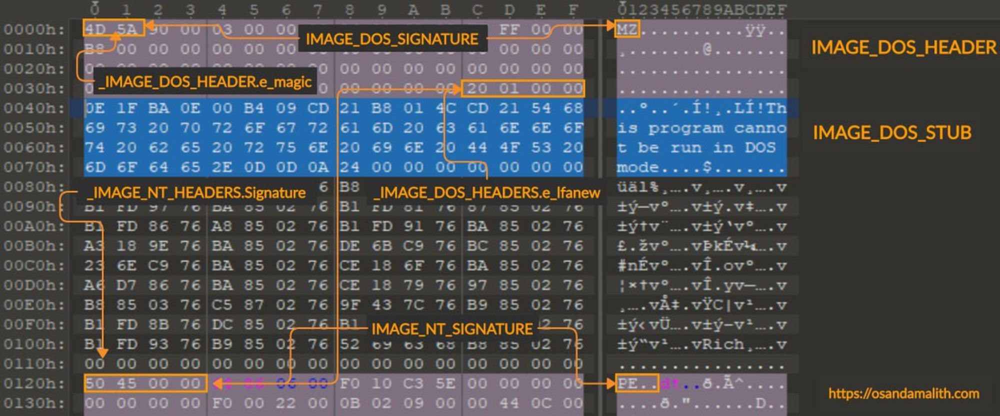
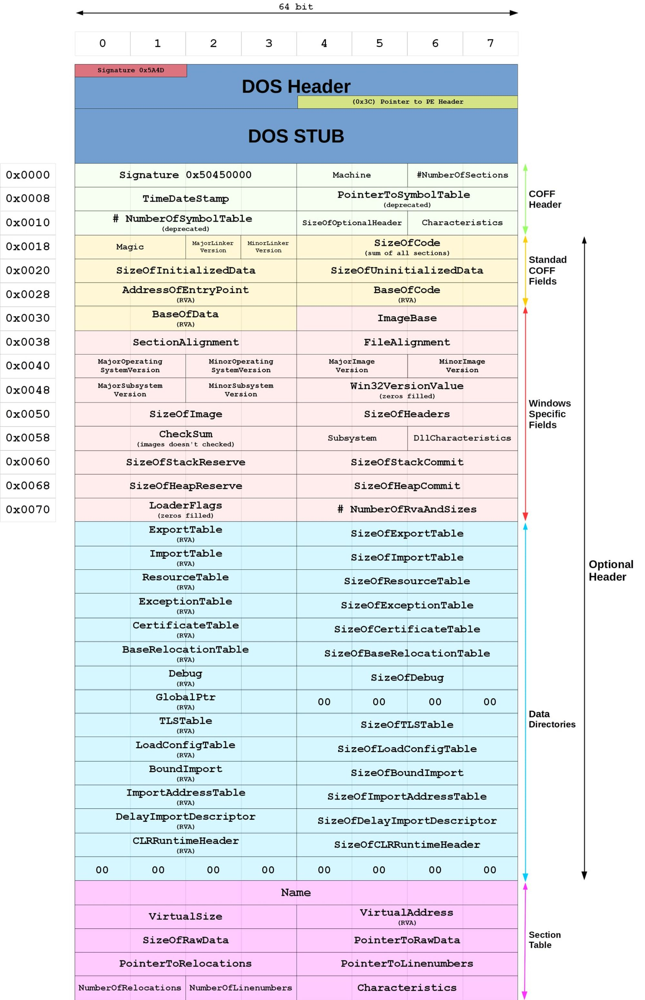

# ThereIsNoInfoRoma NTO-InfoSec 2022-2023 Write-Ups
## Task Based Round 
### Web 
1. Web 1

Принимающий сервер по ошибке умеет читать XML из запроса к серверу по websocket'у.

Ловим запрос от клиента к серверу, декодируем его встроенной функцией decrypt():

'{"format":"json","data":{"countries":["ALA"],"startdate":"2023-03-24","enddate":"2023-03-28","resttype":2}}'

Малформируем запрос под свои нужды, меняем формат и полезную нагрузку в попытке применить уязвимость типа XML External Entity (XXE). Чтобы не выбило ошибку, аккуратно расставляем кавычки, не escape'им символы (иначе возникнут конфликты), создаём сущность типа SYSTEM

<!DOCTYPE data [<!ENTITY file SYSTEM "file:///flag.txt">]><countries>["ALA"]</countries><startdate>&file;</startdate><enddate>2023-03-24</enddate><resttype>2</resttype>

Отправляем следующий запрос на сокет, читаем флаг.


2. Web 2

В сорцах сервиса на 3002 порте видим хардкод хедеров, что наводит на мысль о CRLF атаке. В BurpSuite открываем POST-запрос на /register и отправляем в Repeater.
Добавляем в параметр username спецсимволы `\r\n\r`, чтобы вызвать ошибку ```Bad Request Bare CR or LF found in header line```. (В последствии оказывается, что с `\r\n\r` не работает, поэтому энкодим их -> `%0d%0a%0d`). Отправляем запрос, редиректим на /, берем куку из Response и вставляем ее в хедеры в начальном POST-запросе. Отправляем запрос, редиректим на /, получаем ошибку, и в ней флаг. 


3. Web 3

Web-3.

Используя исходный код прилоржения, приходим к выводу, что прложение обслуживается на сервере Express NodeJS.

В JS есть три волшебных слова: proto, prototype и contructor (эксплуатируется очень редко).

Замечаем в корневом документе index.js строчку /pollute..., а также упоминание прототипов объектов (__proto__). Исходя из этого, отталкиваемся от предположения, что мы работаем с уязвимстью типа server-side prototype pollution. В чём заключается суть данной уязвимости? В JS у каждого объекта есть предопределённые параметры, каждый объект представляет из себя словарь таких параметров, сам язык глубоко завязан на наследственности. Когда у какого-то объекта вызывается параметр, в случае, если он не задан, JS ссылается на так называемый прототип - стандартное значение, которое присваивается параметру в случае его отсутствия.

Находим утилиту https://github.com/yeswehack/pp-finder, которая позволяет узнать какие прототипы используются при выводе каких методов --> если вызываем какой-то метод, то он выводит какие прототипы испольльзуются. Утилита в какой-то степени "бэкдорит" nodejs таким образом, что когда вызывается определённый модуль, то софт соообщает нам потенциальных параметров-'кандидатов' для эксплуатации (т.е. отображает все запросы, которые приходят с кода). Нашей задачей является искать pollution-гаджеты. Хукаем наше приложение, экспериментируем, слушаем.

Основная особенность запросов req в Express заключается в том, что между запросами можно передавать данные, таким образом с точки зрения аналитики нам представляется возможность с ним "поиграться".

Но с точки зрения эксплойта это применимо не всегда. Например, мы не сможем через прототипы перезаписать локал реквест, по причине того, что этот метод в коде "иерархически" был объявлен раньше (выше), чем объявилась функция "/pollute".

    app.use("/*", (req, res, next) => {
        req.isLocalRequest = req.ip.includes("127.0.0.1")
        next()
    })

Что нам нужно: получить доступ к админской панели, а именно:

    app.use("/admin/*", (req, res, next) => {
        if (!req.isLocalRequest) return res.send("You should make request locally")
        next()
    })

    app.get("/admin/flag", (req, res) => {
        res.send(flag)
    })


Находим следующий интересный параметр в модуле passport.

Начинаем исследовать этот параметр

    req.login =
    req.logIn = function(user, options, done) {
    if (typeof options == 'function') {
        done = options;
        options = {};
    }
    options = options || {};
    
    var property = this._userProperty || 'user';
    var session = (options.session === undefined) ? true : options.session;

Таким образом мы понимаем, что параметр _userProperty напрямую связан с текущим юзером на сайте

(
    
    if (options.userProperty) {
      req._userProperty = options.userProperty;
    }
    
)

Понимая, что мы не можем напрямую перетереть значения isLocalRequest, чтобы удовлетворить условие входа в админку, принимаем решение выполнить манипуляцию посредством подстановки значения isLocalRequest в userProperty в результате простой догадки после перебора многих вариантов значений, которые являются кандидатами для эксплойта.

Итоговый запрос: `http://10.10.6.10:3000/pollute/_userProperty/isLocalRequest`, пробуем авторизоваться - перебрасывает на "What's your name?"

Сначала не удаётся зайти в админку, предполагаем что дело в том, что браузер по какой-то причине не хранит cookie. Хватаем запрос бурпом, в этот раз проделывая всё с заданной сессией, заходим по /admin/flag, читаем флаг.


### Crypto
1. Crypto 1

Данный в задании класс является собственным (кастомным) алгоритмом хэширования, построенный на диэдральных группах (Диэдральные группы в математике описывают симметрию правильных многоугольников). Класс DihedralCrypto принимает на ввод флаг для хэширования и сохраняет результат работы алгоритма в файле "hashed".

Специальный метод `__init__` инициализирует объект класса DihedralCrypto с заданным порядком диэдральной группы (её размером).

Метод `__pow` считает элемент диэдральной группы, возведенный в степень заданного показателя `exp`.

Метод `__byte_to_dihedral` переводит значение (в байтах) в элемент диэдральной группы возводя значение центра группы в степень байта, умноженного на постоянный паддинг (нерелевантный кусок информации).

Метод `_map` сопоставляет элемент диэдральной группы с его индексом в списке всех элементов группы, возвращает его в функцию. Соответственно, _unmap проделывает обратное (возвращает индекс).

`_hash`, как следует из названия, хэширует ввод, переводя байты флага в элементи диэдральной группы и замещая их индексами соответствующих им элементов в массиве элеметнов группы.

Логично предположить, что для решения таска требуется обратить алгоритм, но в нашем случае хэширование работает только в одну сторону. Это не отменяет того факта, что можно сбрутфорсить различные комбинации байтов, хэшируя их данным классом и сопоставляя вывод с захэшированным флагом в надежде на чудо.

Напишем декриптор на Python:

```from sage.all import *

class DihedralCryptoDecryptor:
    def __init__(self, order: int) -> None:
        self.__G = DihedralGroup(order)
        self.__order = order
        self.__gen = self.__G.gens()[0]
        self.__list = self.__G.list()
        self.__pad = 31337

    def __pow(self, elem, exp: int):
        try:
            elem = self.__G(elem)
        except:
            raise Exception("not dihedral")
        answer = self.__G(())
        aggregator = elem
        for bit in bin(int(exp))[2:][::-1]:
            if bit == '1':
                answer *= aggregator
            aggregator *= aggregator
        return answer 

    def __dihedral_to_byte(self, elem):
        index = self.__list.index(elem)
        exp = 0
        while True:
            power = self.__pow(self.__gen, exp * self.__pad)
            if power == elem:
                return exp
            exp += 1

    def decrypt(self, encrypted):
        decrypted = []
        for value in encrypted:
            elem = self.__list[value]
            byte = self.__dihedral_to_byte(elem)
            decrypted.append(byte)
        return bytes(decrypted).decode('utf-8')

if __name__ == "__main__":
    enc = [277, 92, 775, 480, 160, 92, 31, 586, 277, 801, 355, 489, 801, 31, 62, 926, 725, 489, 160, 92, 31, 586, 277, 801, 355, 489, 1281, 62, 801, 489, 1175, 277, 453, 489, 453, 348, 725, 31, 348, 864, 864, 348, 453, 489, 737, 288, 453, 489, 889, 804, 96, 489, 801, 721, 775, 926, 1281, 631]
    dihedral_decryptor = DihedralCryptoDecryptor(1337)
    dec = dihedral_decryptor.decrypt(enc)
    print(dec)
```

2. Crypto 2

Таск основан на вероятностной криптографии, поэтому для правильного ответа делаем 50 запросов на каждый бит, чтобы более точно определить, принадлежит ли итоговое число к диапазону [n // 2, n). Если все 50 раз это условие выполнялось, то бит = 0, в противном случае бит = 1.

Приводим скрипт, с помощью которого получаем флаг:
```
from Crypto.Util.number import *
from math import gcd
import requests
import sys

b = 118339604356783802158774426272133925509906965658839380361420935086834059866720564844344177606009941694422253481211450341666607698171278304266475468823607014301861341451212472978414062511623628576536600297791957534803486943153635477041561536069063263912716557999565415296592046901130839942873067995045485546343

i = 0
s = ""
while True:
    try:
        print(i)
        k = 0
        for j in range(50):
            url = f"http://10.10.6.10:1177/guess_bit?bit={i}"
            response = requests.get(url).json()
            a = response["guess"]
            if b // 2 <= a < b:
                k += 1
        if k == 50:
            s += "0"
        else:
            s += "1"
        i += 1
    except Exception as e:
        print(s)
        print(int(s, 2))
        print(long_to_bytes(int(s, 2)))
        sys.exit()
```


### Reverse
1. Reverse 1

На вход получаем файл "reverse1.exe"

Исследуя его UNIX-утилитой file, обнаруживаем, что это 64-битный PE-исполняемый. Исполнив файл из-под эмулятора среды ОС Windows wine в связке с winetricks, приходим к выводу о том, что файл для нас пользы в текущем его представлении не имеет, кроме как вывод "Hello World!" в пользовательский вывод. Если это не 64 и не 32 бита, то делаем вывод, где в 64-битном PE могут содержаться участки `16-битного` кода.

Хоть файл и показал общую его 64-битную архитектуру, тыкаемся дальше. Открываем файл в хекс-редакторе, находим некоторые участки, например `This program can <...> be run in DOS mode`, сведения о секциях типа .data, .rdata, .text и других, а также находим манифест приложения и упоминание о pdb-файле с дебаг символами. Среди всего этого находим подтверждения нашим словам, вкупе с тем, что есть уведомление о DOS-режиме, замечаем вместе с меткой PE магические байты MZ в самом начале файла, что свидетельствует о 16-битном бинарном файле.

Часть с 16-битным кодом называется `DOS stub`, структура последнего приведена ниже на фото из интернета. В хекс-редакторе, xxd или hexed.it (web) открываем наш файл, отрезаем редактором все до байтов stub'a, записываем как отдельный бинарный файл. Для корректной работы с DOS нам потребуется эмулятор. Оптимальным вариантом является dosbox, который содержится в репозиториях Kali. Примонтировав папку с нашим файлом и исполнив, замечаем, что файл печатает символы, как будто намеренно (sleep'ается). Обращаем внимание на то, что сообщение о совместимости с DOS в stub'e написано не в традиционной манере (есть незнакомые байты), т.е. мы имеем дело с кастомным стабом, в нашем случае он печатает флаг. Дизассемблируем бинарный файл (выбрали r2 с GUI Cutter), находим инструкцию которая бросает нас в цикл с задержкой по времени, патчим эту инструкцию на NOP, таким образом избавляемся от задержки и читаем полный флаг.




## Incident Response

### Linux (Task 1)

1. Как злоумышленник попал на машину?

После запуска лаунчера Валера исполнил Java-класс Malware (видно из java decompiler), в котором содержится вредосное ПО, прокидывающее reverse shell на машину Сергея. Слушалка атакующего запускается с 192.168.126.129 по порту 4444, после чего на сокет жертвы засылается процесс, исполняющий `/usr/bin/bash`, затем атакующий получает шелл от юзера `sergey`.

2. Как злоумышленник повысил свои права? 

Заметим, что в папке загрузок помимо прочих улик, которые оставил злоумышленник, находится `linpeas.sh` - скрипт, который автоматизированно ищет возможности совершить privilege escalation за счёт уязвимостей, содержащихся в дефолтных бинарных приложениях на Linux’e. Прогоняем скрипт, замечаем что linpeas пометил утилиту find как критически уязвимую. Мы можем совершить privesc через suid/guid. В нашем случае, find лежит по `/usr/bin/find`, а права у него записаны как `-rwsr-sr-x` (пользователь - группа - все остальные, но в нашем случае у нас стоит бит 4 [u+s], который устанавливает suid-атрибут, разрешающий другим пользователям запускать исполняемые файлы с правами овнера или группы исполняемого файла). Таким образом, файл от нашего user id выполняется с повышенными привилегиями. Злоумышленник применил эксплойт: (пример) `sudo find . -exec /bin/sh \; -quit`, после чего получил доступ к рутовому шеллу.

3. Как злоумышленник узнал пароль от passwords.kdbx? 

По уликам мы заметили, что злоумышленник с исходников скомпилировал кейлоггер `logkeys`.

4. Куда logkeys пишет логи? 

Находим по [репозиторию на гитхабе](https://github.com/kernc/logkeys/blob/master/README.md#usage-how-to) дефолтное расположение лога кейлоггера - `/var/log/logkeys.log` (см. фото). Если быть точнее, то софт создаёт скрипты на запуск, на остановку и само логгирование.

Видим следующее:

```
Logging started ...

2023-02-10 07:55:45-0500 &gt; kee
2023-02-10 07:55:57-0500 &gt; 
2023-02-10 07:55:57-0500 &gt; 
2023-02-10 07:55:58-0500 &gt; keepass2
2023-02-10 07:56:02-0500 &gt; 1_D0N7_N0<#+32>W_WHY_N07_M4yY83_345Y
2023-02-10 07:57:34-0500 &gt; 

Logging stopped at 2023-02-10 07:57:34-0500
```
По всей видимости был набран на клавиатуре пароль от Keepass’a, цепляем его. <#+32> означает, что предыдущую клавишу (левый shift) нажимали 32 раза, для нас это не имеет существенного значения, игнорируем. Итог: `1_D0N7_N0W_WHY_N07_M4Y83_345Y`.

5. Как злоумышленник попал на машину? 

`SecretP@ss0rdMayby_0rNot&` - пароль от Windows RDP.

6. Дополнительно:

VTropia.exe: был найден в Downloads, при попытке изучить файл в ghidra стало понятно, что написан на C#. Для его декомпила использовали ILSpy. Была найдена зашифрованная информация (user, message, ip). Дешифровали её с помощью b64 и xor: 

**ip**: [ссылка](https://pastebin.com/raw/VRjvXMu1) на pastebin

**user**: NTI-User

**message**: Sad to say, but all your files have been encrypted! But don't cry, there's the way to recover them - pay 500$ in BTC to this wallet: `3J98t1WpEZ73CNmQviecrnyiWrnqRhWNLy`. You have 24 hours. After them your files will stay unaccessible for next eternity.

Функция `CalculateKey()` выводит следующие значения:
```
ключ: HelloWinNTI-User (md5)084b988baa7c8d98cda90c5fe603c560
альтернативный ключ: (md5)d7d129356554062f0311ee22d59ea9eb
```

### Windows (Task 2)

1. Какой пароль от Ransomware?

`HelloWinNTI-User` (md5)084b988baa7c8d98cda90c5fe603c560 - пароль от Ransomware.

2. Какие процессы в системе являются вредоносными?

1.exe, 2.exe, 3.exe, 4.exe, 5.exe - эти процессы запускаются во время использования программы doom.exe.
